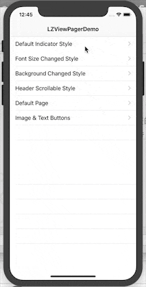

<p align="center"></p>
<p align="center">
    <a href="https://github.com/ladmini/LZViewPager">
        
    </a>
    <a href="https://github.com/ladmini/LZViewPager">
    
    </a>
    <a href="https://github.com/ladmini/LZViewPager">
        
    </a>
	<a href="https://github.com/ladmini/LZViewPager">
        
    </a>
</p>

<p align="center">
    
</p>
 
## ⭐️ Features
- [x] Support Swift 5.
- [x] Super easy to implement page view controller with indicator bar.
- [x] Simplistic, yet highly extensive customisation.
- [x] Full support for custom components.
- [x] Built on a powerful and informative page view controller.
- [x] Header scrollable, if the width of buttons is larger than the width of the current view.

## 📋 Requirements
LZViewPager requires iOS 10, Swift 5


## 📲 Installation
### CocoaPods
LZViewPager is available through [CocoaPods](http://cocoapods.org). To install it, simply add the following line to your Podfile:

```ruby
pod 'LZViewPager', '~> 1.2.5'
```

And run `pod install`.

**If your pod install doesn't work properly, maybe your pod repository needs to be updated. You can try**
```ruby
pod repo update
```
**and then run**
```ruby
pod install
```


### Carthage
LZViewPager is also available through [Carthage](https://github.com/Carthage/Carthage). Simply install carthage with [Homebrew](http://brew.sh/) using the following command:

```bash
$ brew update
$ brew install carthage
```

#### Carthage dependency
Since this project depends on SnapKit(A Swift Autolayout DSL for iOS & OS X). You can add LZViewPager to your `Cartfile` like this:

```ogdl
github "SnapKit/SnapKit" ~> 5.0.0
github "ladmini/LZViewPager" ~> 1.2.5
```
### Manually
If you prefer not to use either of the aforementioned dependency managers, you can integrate LZViewPager into your project manually. Just copy the following 3 files into your project.

1) LZViewPager.swift
2) LZViewPagerHeader.swift
3) LZViewPagerContent.swift

## 🚀 Usage

### The Basics

1) Create a `ViewController` and provide a `LZViewPagerDelegate`, `LZViewPagerDataSource` 

2) Drag a UIView into ViewVontroller's view and set it's type to LZViewPager, then set an outlet variable as "viewPager"

<p align="center">
    
</p>

3) Set the items you want to display

4) Set the hostController to self

5) viewPager.reload()

```swift
class ViewController: BaseViewController, LZViewPagerDelegate, LZViewPagerDataSource {
    @IBOutlet weak var viewPager: LZViewPager!
    private var subControllers:[UIViewController] = []
    override func viewDidLoad() {
        super.viewDidLoad()
        viewPager.dataSource = self
        viewPager.delegate = self
        viewPager.hostController = self
        let vc1 = UIViewController.createFromNib(storyBoardId: "ContentViewController1")!
        vc1.title = "Title1"
        let vc2 = UIViewController.createFromNib(storyBoardId: "ContentViewController2")!
        vc2.title = "Title2"
        let vc3 = UIViewController.createFromNib(storyBoardId: "ContentViewController3")!
        vc3.title = "Title3"
        let vc4 = UIViewController.createFromNib(storyBoardId: "ContentViewController4")!
        vc4.title = "Title4"
        subControllers = [vc1, vc2, vc3, vc4]
        viewPager.reload()
    }
}
```

2) Implement `LZViewPagerDataSource`.

```swift
    func numberOfItems() -> Int {
        return self.subControllers.count
    }
    
    func controller(at index: Int) -> UIViewController {
        return subControllers[index]
    }
    
    func button(at index: Int) -> UIButton {
        //Customize your button styles here
        let button = UIButton()
        button.setTitleColor(UIColor.black, for: .normal)
        button.titleLabel?.font = UIFont.systemFont(ofSize: 16)
        return button
    }
```

3) All done! 🎉

## Customization
You can customize you button styles in datasource method "func button(at index: Int) -> UIButton" you can also customize other styles by implementing other datasource methods example:

```swift
func heightForHeader() -> CGFloat
func backgroundColorForHeader() -> UIColor
func heightForIndicator(at index: Int) -> CGFloat
func colorForIndicator(at index: Int) -> UIColor
func shouldShowIndicator() -> Bool
func widthForButton(at index: Int) -> CGFloat
func widthForIndicator(at index: Int) -> CGFloat
func buttonsAligment() -> ButtonsAlignment
func shouldEnableSwipeable() -> Bool
func leftMarginForHeader() -> CGFloat //default is 0
func rightMarginForHeader() -> CGFloat //default is 0
func shouldShowSeparator() -> Bool // default is false
func colorForSeparator()-> UIColor // default is .white
func heightForSeparator() -> CGFloat // default is 2.0
func leftMarginForSeparator() -> CGFloat //default is 0
func rightMarginForSeparator() -> CGFloat //default is 0
func topMarginForSeparator() -> CGFloat //default is 0
```


## Delegate
Implementing delegate methods if needed

```swift
func didSelectButton(at index: Int)
func willTransition(to index: Int)
func didTransition(to index: Int)
```
## Instance methods for LZViewPager
When your datasource changed you should call reload() method to refresh.
If you want to locating to some page programming you can call select(index: Int, animated: Bool) method, It is important to note that animated is an optional parameter in order to be compatible with the previous versions. If you do not specify animated, it is true by default. 

```swift
func reload()
public func select(index: Int, animated: Bool = true)
```

## Instance property for LZViewPager

```swift
public var currentIndex: Int?
```


## How to run this demo
1) Clone this repository
2) Execute carthage update
3) Build and Run

## ⚠️ Troubleshooting
If you are encountering issues with LZViewPager, please raise an [issue](https://github.com/ladmini/LZViewPager/issues/new).

## 👨🏻‍💻 About
- Created by [Ladmini](https://github.com/ladmini) ([Mail to ladmini](mailto:ladmini@126.com))
- Contributed to by a growing [list of others](https://github.com/ladmini/LZViewPager/graphs/contributors).
- Logo was designed by **Tobaloidee**.


## ❤️ Contributing
Bug reports and pull requests are welcome on GitHub at [https://github.com/ladmini/LZViewPager](https://github.com/ladmini/LZViewPager).

## 👮🏻‍♂️ License
The library is available as open source under the terms of the [MIT License](http://opensource.org/licenses/MIT).
