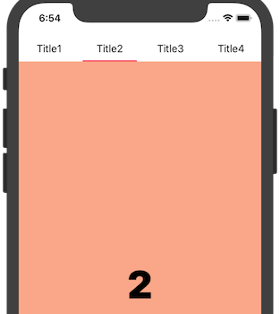

<p align="center">
    <a href="https://github.com/ladmini/LZViewPager">
        
    </a>
    <a href="https://github.com/ladmini/LZViewPager">
        
    </a>
	<a href="https://github.com/ladmini/LZViewPager">
        
    </a>
</p>

<p align="center">
    
</p>
 
## ⭐️ Features
- [x] Super easy to implement page view controller with indicator bar.
- [x] Simplistic, yet highly extensive customisation.
- [x] Full support for custom components.
- [x] Built on a powerful and informative page view controller.

## 📋 Requirements
LZViewPager requires iOS 9, Swift 4


## 📲 Installation
### CocoaPods
Tabman is available through [CocoaPods](http://cocoapods.org). To install it, simply add the following line to your Podfile:

```ruby
pod 'LZViewPager', '~> 0.0.1'
```

And run `pod install`.

### Carthage
Tabman is also available through [Carthage](https://github.com/Carthage/Carthage). Simply install carthage with [Homebrew](http://brew.sh/) using the following command:

```bash
$ brew update
$ brew install carthage
```

Add Tabman to your `Cartfile`:

```ogdl
github "uias/Tabman" ~> 1.0
```

## 🚀 Usage

### The Basics

1) Create a `ViewController` and provide a `LZViewPagerDelegate`, `LZViewPagerDataSource` 

2) Drag a UIView into ViewVontroller's view and set it's type to LZViewPager, then set an outlet variable as "viewPager"

<p align="center">
    
</p>

3) Set the items you want to display

4) Set the hostController to self

5) viewPager.reload()

```swift
class ViewController: BaseViewController, LZViewPagerDelegate, LZViewPagerDataSource {
    @IBOutlet weak var viewPager: LZViewPager!
    private var subControllers:[UIViewController] = []
    override func viewDidLoad() {
        super.viewDidLoad()
        viewPager.dataSource = self
        viewPager.delegate = self
        viewPager.hostController = self
        let vc1 = BaseViewController.createFromNib(storyBoardId: "ContentViewController1") as! ContentViewController1
        vc1.title = "Title1"
        let vc2 = BaseViewController.createFromNib(storyBoardId: "ContentViewController2") as! ContentViewController2
        vc2.title = "Title2"
        let vc3 = BaseViewController.createFromNib(storyBoardId: "ContentViewController3") as! ContentViewController3
        vc3.title = "Title3"
        let vc4 = BaseViewController.createFromNib(storyBoardId: "ContentViewController4") as! ContentViewController4
        vc4.title = "Title4"
        subControllers = [vc1, vc2, vc3, vc4]
        viewPager.reload()
    }
}
```

2) Implement `LZViewPagerDataSource`.

```swift
    func numberOfItems() -> Int {
        return self.subControllers.count
    }
    
    func controller(at index: Int) -> UIViewController {
        return subControllers[index]
    }
    
    func button(at index: Int) -> UIButton {
        //Custom your button styles here
        let button = UIButton()
        button.setTitleColor(UIColor.black, for: .normal)
        button.titleLabel?.font = UIFont.systemFont(ofSize: 16)
        return button
    }
```

3) All done! 🎉

### Customization
You can custom you button styles in datasource method "func button(at index: Int) -> UIButton" you can also Customize other styles by implementing other datasource methods example:

```swift
func heightForHeader() -> CGFloat
func heightForIndicator(at index: Int) -> CGFloat
func colorForIndicator(at index: Int) -> UIColor
func shouldShowIndicator() -> Bool
```


### Delegate
Implementing delegate methods if needed

```swift
didSelectButton(at index: Int)
willTransition(to index: Int)
didTransition(to index: Int)
```
### Instance methods for LZViewPager
If you want to locating to some page programming you can call select(index: Int) method

```swift
func select(index: Int)
```

## ⚠️ Troubleshooting
If you are encountering issues with LZViewPager, please raise an [issue](https://github.com/ladmini/LZViewPager/issues/new).

## 👨🏻‍💻 About
- Created by [Ladmini](https://github.com/ladmini) ([Mail to ladmini](mailto:ladmini@126.com))
- Contributed to by a growing [list of others](https://github.com/ladmini/LZViewPager/graphs/contributors).


## ❤️ Contributing
Bug reports and pull requests are welcome on GitHub at [https://github.com/ladmini/LZViewPager](https://github.com/ladmini/LZViewPager).

## 👮🏻‍♂️ License
The library is available as open source under the terms of the [MIT License](http://opensource.org/licenses/MIT).
